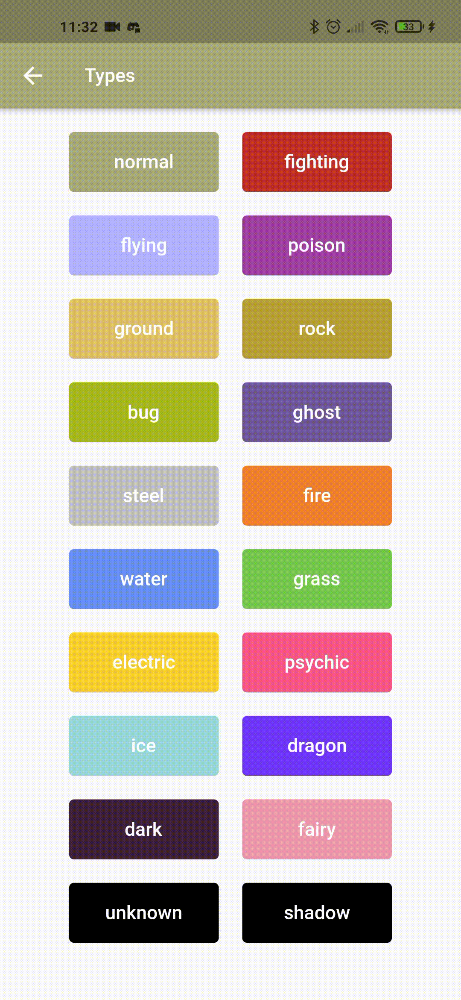

# Pokedex App

Hello there! Welcome to my first ever flutter app (the name is self-explaining). 

## Getting Started

This project is a starting point for a Flutter application.

A few resources to get you started if this is your first Flutter project:

- [Lab: Write your first Flutter app](https://flutter.dev/docs/get-started/codelab)
- [Cookbook: Useful Flutter samples](https://flutter.dev/docs/cookbook)

## What did it do?

The app actually shows you 3 main informations: [pokemon](#the-pokemon-species), [types](#tye-pokemon-types) and [abilities](#the-pokemon-abilities), and a extra screen with [pokemon moves](#the-pokemon-moves)

  ### The pokemon species
  
  The first section shows you lists with all the 898 registered pokemon, separated by generation. Clicking on the pokemon name, you'll go to a screen with Pokemon info:
    
  - Name;
  - Type(s);
  - Base stats;
  - Image and sprites in-game;
  - A random description from any pokedex that this pokemon appears;
  - List with this pokemon's moves and abilities;
  
  The text colors in pokemon details are associated to the pokemon main type (except the secondary type, if it exists, which have your color associated to itself). You can see this association, if you want, [here](#type-colors). You can also click on any type, move or ability and go to its respective screen.
 
  Example:
  <br />
  
  <br />
  
  ### The pokemon types
  
  This section shows you all the 18 existing types (and 2 extra that i explain [here](#shadow-and-uknown-types)). Each button color is associated to its type, that you can (again) see, if you want, [here](#type-colors). Clicking on the type, you'll go to a screen with type info:
  
  - The moves of this type;
  - The Pokemon that have this type;
  - The damage relations with other types:
    - Super effective: Types that suffer double damage from the actual type;
    - Half effective: Types that suffer half damage from the actual type;
    - Resistance: Types that deal half damage from the actual type;
    - Weakness: Types that deal double damage from the actual type;
    - Immunity: Types that deal no damage from the actual type;
    - No effective: Types that suffer no damage from the actual type;
  
  Example:  
  <br />
  
  <br />
  
  #### Shadow and Uknown types

  Well, you probably saw two black buttons named "unkown" and "shadow" and asked yourself "What are these types?". Well, i don't know too, sorry ;-;
  <br />
  Ok, trying to explain: these two extra types are from PokeAPI so they appear for now, but they don't exist really in the game and i really don't no why they appear in the database. I pretend to treat it in the future, and you can click [here](#more-to-come) so see this and another future updates.

  ### The pokemon abilities
  
  This section shows you all pokemon abilities. Clicking on the ability nome, you'll go to a screen with ability info:
  
  - A description of what the ability does;
  - A list with all the pokemon that might have this ability.
  
  The text color in this screen is associated with the generation that the ability was created. You can see this association [here](#generation-types). You can also click on the pokemon names and go to its screen.
 
  Example:
  <br />
  
  <br />

  ### The Pokemon moves

  There isn't a screen listing the pokemon moves. You can access it from any type or pokemon screen. Clicking on the move name, you'll go to a screen with move info:
  
  - A random description from any pokedex that this move appears;
  - The move effect (deals damage, may burn, paralyse, increase some stats, something like these);
  - The move type, class (physical, special or status), PP (number of times that the move can be used) and power (if it exist);
  - A list with all pokemon that can learn this move.

  Example:
  <br />
    
  <br />

  The text color of this page is associated to the type of the move, that you can see (one more time), if you want, [here](#type-colors). You can also click on the pokemon or type names and go to its screen.
  
  ## Type colors

  Each pokemon type have its representative color. These colors are:

  ```bash
  Normal: #A8A878
  
  Fighting: #C03028
  
  Flying: #B3B3FF
  
  Poison: #A040A0
  
  Ground: #E0C068
  
  Rock: #B8A038
  
  Bug: #A8B820
  
  Ghost: #705898
  
  Steel: #C0C0C0
  
  Fire: #F08030
  
  Water: #6890F0
  
  Grass: #78C850
  
  Electric: #F8D030
  
  Psychic: #F85888
  
  Ise: #98D8D8
  
  Dragon: #7038F8
  
  Dark: #3E223A
  
  Fairy: #EE99AC
  ```

  ## Generation colors

  The generation don't have specific colors, so i choose randomly from the type colors one for each one. These are:

  ```bash
  Generation 1 (Kanto): #78C850

  Generation 2 (Jothoh): #F08030

  Generation 3 (Hoenn): #6890F0

  Generation 4 (Sinnoh): #F8D030

  Generation 5 (Unova): #E0C068

  Generation 6 (Kalos): #EE99AC

  Generation 7 (Alola): #C03028

  Generation 8 (Galar): #F85888
  ```

  ## More to come
  
For help getting started with Flutter, view our
[online documentation](https://flutter.dev/docs), which offers tutorials,
samples, guidance on mobile development, and a full API reference.
